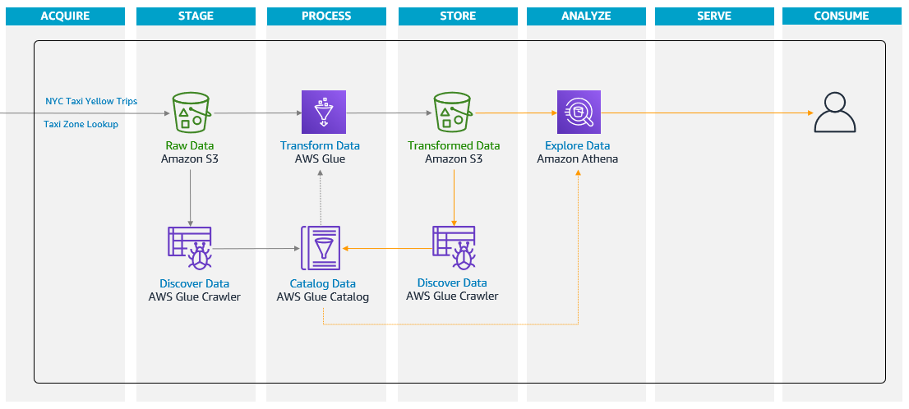
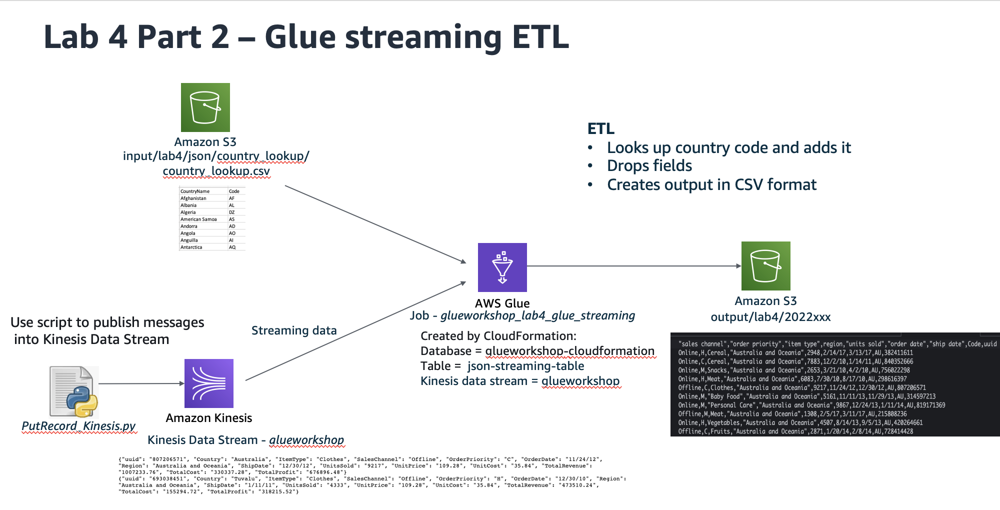

# AWS CDKによるAWS Glueの実装例
AWS Glue関連のWorkshopをAWS CDKで実装した例をいくつか格納してる。

## AWS Serverless Data lake JumpStart
GlueによるETLを学ぶワークショップ。

[Workshop](https://catalog.us-east-1.prod.workshops.aws/workshops/276faf92-bffc-4843-8a8e-8078add48194/en-US)




### Query

```sql
-- total records
-- 4347658
SELECT COUNT(*) "Count"
FROM   yellow_tripdata;

-- 2020-10-01 1575353
-- 2020-11-01 1409851
-- 2020-12-01 1362454
SELECT DATE_TRUNC('month', pickup_datetime) "Period",
       COUNT(*) "Total Records"
FROM   yellow_tripdata
GROUP BY DATE_TRUNC('month', pickup_datetime)
ORDER BY 1;
```


###
```sql
CREATE OR REPLACE VIEW v_yellow_tripdata
AS
SELECT CASE vendor_id
            WHEN 1 THEN 'Creative Mobile'
            WHEN 2 THEN 'VeriFone'
            ELSE 'No Data'
       END "vendor_name",
       pickup_datetime,
       dropoff_datetime,
       passenger_count,
       trip_distance,
       CASE ratecodeid
            WHEN 1 THEN 'Standard Rate'
            WHEN 2 THEN 'JFK'
            WHEN 3 THEN 'Newark'
            WHEN 4 THEN 'Nassau/Westchester'
            WHEN 5 THEN 'Negotiated Fare'
            WHEN 6 THEN 'Group Ride'
            WHEN 99 THEN 'Special Rate'
            ELSE 'No Data'
       END "rate_type",
       store_and_fwd_flag,
       pu_borough,
       pu_zone,
       pu_service_zone,
       do_borough,
       do_zone,
       do_service_zone,
       CASE payment_type
            WHEN 1 THEN 'Credit Card'
            WHEN 2 THEN 'Cash'
            WHEN 3 THEN 'No Charge'
            WHEN 4 THEN 'Dispute'
            WHEN 5 THEN 'Unknown'
            WHEN 6 THEN 'Voided Trip'
            ELSE 'No Data'
       END "payment_type",
       fare_amount,
       extra,
       mta_tax,
       tip_amount,
       tolls_amount,
       improvement_surcharge,
       congestion_surcharge,
       total_amount
FROM   yellow_tripdata;


SELECT vendor_name "Vendor",
       rate_type "Rate Type",
       payment_type "Payment Type",
       ROUND(AVG(fare_amount), 2) "Fare",
       ROUND(AVG(extra), 2) "Extra",
       ROUND(AVG(mta_tax), 2) "MTA",
       ROUND(AVG(tip_amount), 2) "Tip",
       ROUND(AVG(tolls_amount), 2) "Toll",
       ROUND(AVG(improvement_surcharge), 2) "Improvement",
       ROUND(AVG(congestion_surcharge), 2) "Congestion",
       ROUND(AVG(total_amount), 2) "Total"
FROM   v_yellow_tripdata
GROUP BY vendor_name,
         rate_type,
         payment_type
ORDER BY 1, 2, 3;

```

## Stream
Streaming ETLの実装

[Workshop](https://catalog.us-east-1.prod.workshops.aws/workshops/ee59d21b-4cb8-4b3d-a629-24537cf37bb5/en-US/lab4)



### 実行方法
* ジョブを起動
* 以下でKinesisにデータを送信
* S3にETL後のデータを格納。

```sh
python3 testing/PutRecord_Kinesis.py
```


## RDS
AuroraのCrawlerとGlue Jobを実装

[Workshop](https://catalog.us-east-1.prod.workshops.aws/workshops/ee59d21b-4cb8-4b3d-a629-24537cf37bb5/en-US/lab10)




### RDS Data API実行

```sh
# ARN取得
AURORA_ARN=$(aws cloudformation describe-stacks --stack-name WorkshopServerlessDatalakeStack --output text --query 'Stacks[0].Outputs[?OutputKey == `AuroraArn`].OutputValue')
SECRET_ARN=$(aws cloudformation describe-stacks --stack-name WorkshopServerlessDatalakeStack --output text --query 'Stacks[0].Outputs[?OutputKey == `SecretArn`].OutputValue')

# Data APIの実行確認
aws rds-data execute-statement --resource-arn $AURORA_ARN  --secret-arn $SECRET_ARN --database 'glueworkshop' --sql "select CURRENT_DATE"

# テーブル作成
aws rds-data execute-statement --resource-arn $AURORA_ARN  --secret-arn $SECRET_ARN --database 'glueworkshop' --sql "CREATE TABLE orders ( orderid INT NOT NULL, item VARCHAR(1000) NOT NULL, price DECIMAL(6,2) NOT NULL, orderdate DATE, PRIMARY KEY (orderid) )"

# 複数データ生成
aws rds-data execute-statement --resource-arn $AURORA_ARN  --secret-arn $SECRET_ARN --database 'glueworkshop' --sql "insert into orders values(0,'Webcam',185.49,'2022-01-02')"
aws rds-data execute-statement --resource-arn $AURORA_ARN  --secret-arn $SECRET_ARN --database 'glueworkshop' --sql "insert into orders values(1,'Monitor',240.99,'2022-01-02')"
aws rds-data execute-statement --resource-arn $AURORA_ARN  --secret-arn $SECRET_ARN --database 'glueworkshop' --sql "insert into orders values(2,'Mouse',12.89,'2022-01-03')"
aws rds-data execute-statement --resource-arn $AURORA_ARN  --secret-arn $SECRET_ARN --database 'glueworkshop' --sql "insert into orders values(3,'KeyBoard',24.99,'2022-01-04')"
aws rds-data execute-statement --resource-arn $AURORA_ARN  --secret-arn $SECRET_ARN --database 'glueworkshop' --sql "insert into orders values(5,'HDMI Cable',4.45,'2022-01-06')"

aws rds-data execute-statement --resource-arn $AURORA_ARN  --secret-arn $SECRET_ARN --database 'glueworkshop' --sql "select * from orders"


# Additional Data
aws rds-data execute-statement --resource-arn $AURORA_ARN  --secret-arn $SECRET_ARN --database 'glueworkshop' --sql "insert into orders values(100,'Jewels',44.00,'2022-02-01')"
aws rds-data execute-statement --resource-arn $AURORA_ARN  --secret-arn $SECRET_ARN --database 'glueworkshop' --sql "insert into orders values(101,'Iphone',841.00,'2022-02-02')"
aws rds-data execute-statement --resource-arn $AURORA_ARN  --secret-arn $SECRET_ARN --database 'glueworkshop' --sql "insert into orders values(102,'Toys',41.00,'2022-02-03')"
aws rds-data execute-statement --resource-arn $AURORA_ARN  --secret-arn $SECRET_ARN --database 'glueworkshop' --sql "insert into orders values(103,'Dress',43.00,'2022-02-04')"
aws rds-data execute-statement --resource-arn $AURORA_ARN  --secret-arn $SECRET_ARN --database 'glueworkshop' --sql "insert into orders values(104,'Headphone',24.00,'2022-02-05')"
aws rds-data execute-statement --resource-arn $AURORA_ARN  --secret-arn $SECRET_ARN --database 'glueworkshop' --sql "insert into orders values(4,'Display Cable',20.00,'2022-01-06')"
aws rds-data execute-statement --resource-arn $AURORA_ARN  --secret-arn $SECRET_ARN --database 'glueworkshop' --sql "update orders set price=14.45 where orderid=3"


aws rds-data execute-statement --resource-arn $AURORA_ARN  --secret-arn $SECRET_ARN --database 'glueworkshop' --sql "select * from orders"
```


### Crawler実行

```sh
# Crawler Name取得
CRAWLER_NAME=$(aws cloudformation describe-stacks --stack-name WorkshopServerlessDatalakeStack --output text --query 'Stacks[0].Outputs[?OutputKey == `GlueCrawlerName`].OutputValue')

# Crawler実行
aws glue start-crawler --name $CRAWLER_NAME

# Crawlerのステータス取得
aws glue get-crawler --name $CRAWLER_NAME --query 'Crawler.State'
```

### Job実行

```sh
# Job Name取得
JOB_NAME=$(aws cloudformation describe-stacks --stack-name WorkshopServerlessDatalakeStack --output text --query 'Stacks[0].Outputs[?OutputKey == `GlueJobName`].OutputValue')

# ジョブ実行
aws glue start-job-run --job-name $JOB_NAME

# ジョブのステータス取得
aws glue get-job-runs --job-name $JOB_NAME  --max-results 1 --query 'JobRuns[0].JobRunState'
```